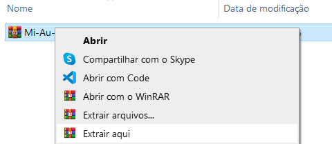
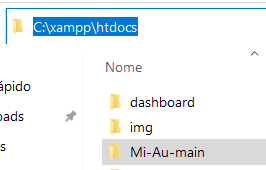
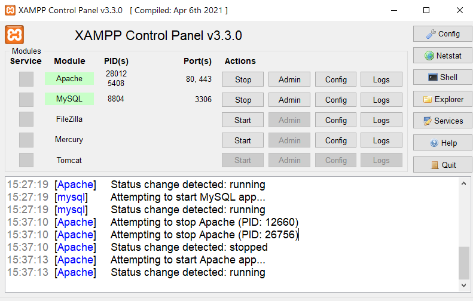
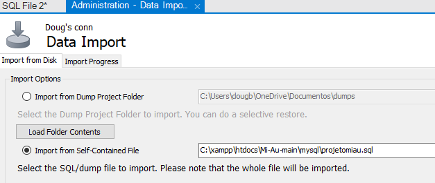

# 🐾 Mi&Au
Mi&Au é um site de adoção de animais (cães 🐶 e  gatos 😺) que foi desenvolvido durante o curso técnico de Informática na Escola Técnica de Ceilândia.

O projeto foi desenvolvido em grupo:
- **Douglas**: responsável pela codificação do site (HTML, CSS, JavaScript, PHP e MySQL)
- **Raylanne**: criou a ideia e o nome do projeto, bem como, foi responsável pela documentação (requisitos, casos de uso e diagrama de classes)
- **Hugo**: auxiliou na criação dos requisitos e casos de uso

 

## 🔧 Ferramentas e Linguagens
A **IDE** escolhida foi o [Visual Studio Code](https://code.visualstudio.com/), pois é fácil de utilizar e também não exige muito da máquina. Também foram utilizados programas como o [brModelo](https://sourceforge.net/projects/brmodelo/), para modelagem de dados, e o 
[Astah UML](https://astah.net/downloads/), para criação de diagramas.

### Linguagens
- As interfaces foram desenvolvidas nas linguagens: *HTML, CSS e JavaScript*;
- Toda a parte lógica do site foi feita em *PHP*, além da conexão com o banco de dados MySQL;

O projeto foi desenvolvido utilizando o padrão de arquitetura [MVC](https://www.devmedia.com.br/introducao-ao-padrao-mvc/29308) (Model-View-Controller), o que permite separar a aplicação em três camadas (modelo, visão e controle) e, além disso, facilita a manutenção do código.

 

## ❔ Como abrir
> [!NOTE]
> É necessário ter instalado os programas [XAMPP](https://www.apachefriends.org/pt_br/index.html) e [MySQL](https://dev.mysql.com/downloads/workbench/)!

1. Primeiro é preciso baixar o projeto em um **arquivo ZIP** e extrair ele na máquina.

    

2. Depois de extrair, deve-se **colar** a pasta do projeto dentro da pasta *C:\xampp\htdocs*.

    

3. Agora é necessário **abrir** o XAMPP e dar start nos serviços *Apache* e *MySQL*.

    

4. Por último, é necessário **importar** o banco de dados do projeto no MySQL Workbench:
    - 4.1. Estar dentro do MySQL
    - 4.2. Abrir uma conexão de BD
    - 4.3. Na barra lateral esquerda em *Administration* selecionar **Data Import/Restore**
    - 4.4. Escolher a opção **Import from Self-Contained File**
    - 4.5. Selecionar o arquivo de banco do projeto que está na pasta: *Mi-Au-main\mysql\projetomiau.sql*
        
    - 4.6 Clicar em **Start Import**

Depois de executar todas as etapas, o projeto deve ser aberto no navegador **Google Chrome**[^1] com a URL *localhost/Mi-Au-main*.

> [!IMPORTANT]
> Caso apareça o erro **NOT FOUND** provavelmente o nome da pasta é diferente do que está na URL! Ex.: *localhost/douglas*

[^1]: O site só é compatível com o Google Chrome!
